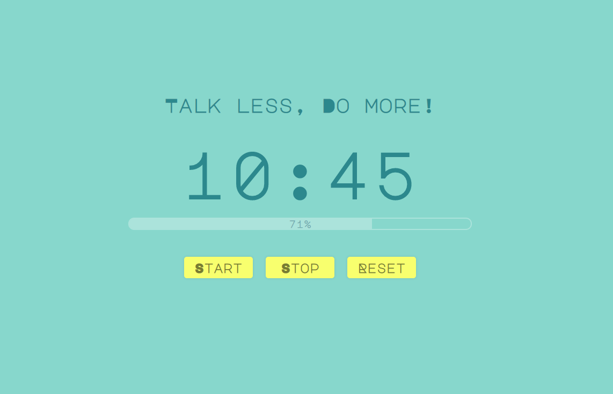

# React Pomodoro!

**Simple Reactjs pomodoro.**
It uses pure JavaScript and Pure CSS.
No additional packages are needed.

## How to run the app?
1. cd {PROJECT_DIR}
2. run `npm install`
3. run `npm start`

# Screenshot
